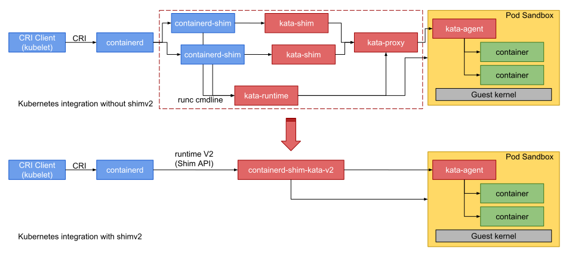
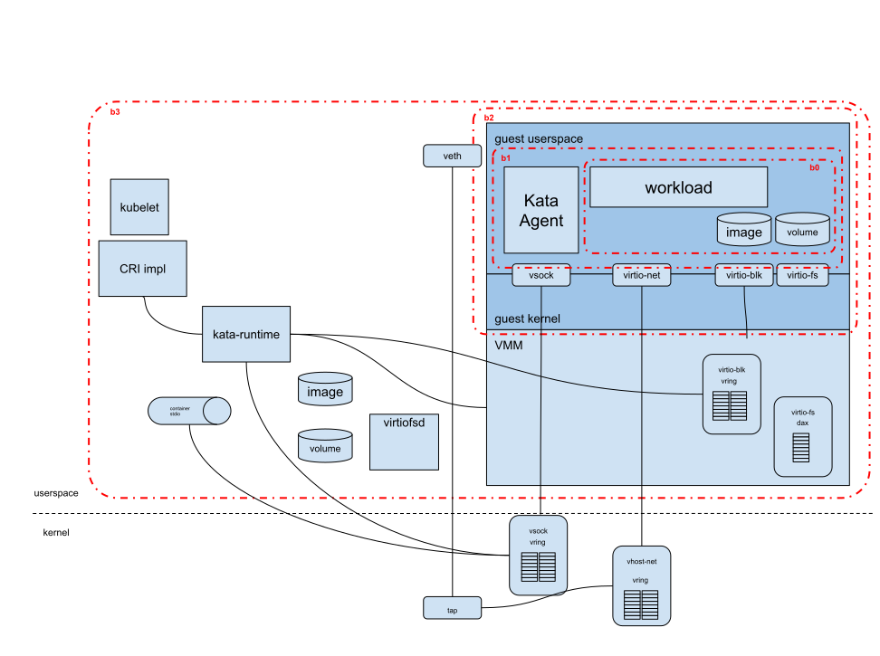
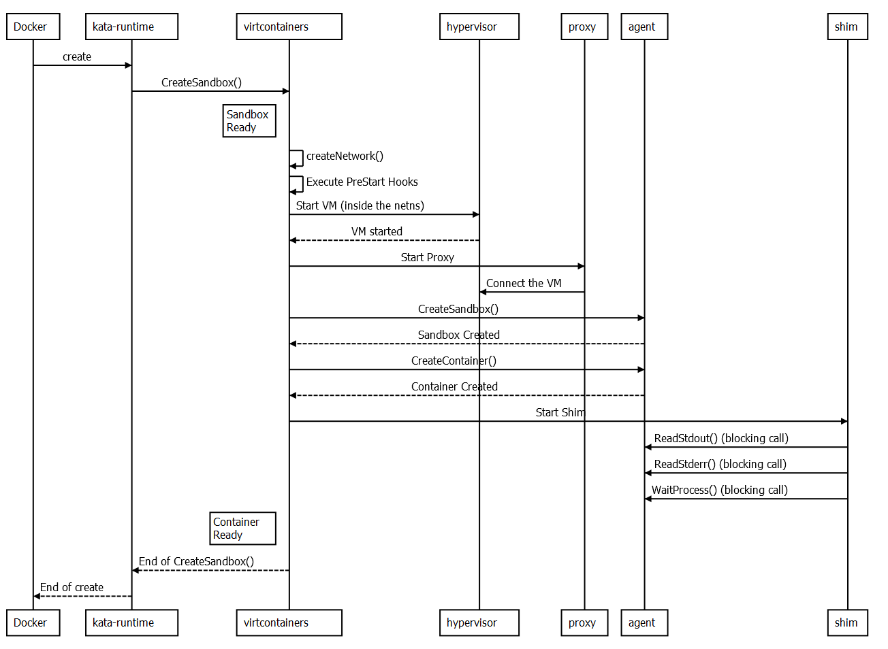
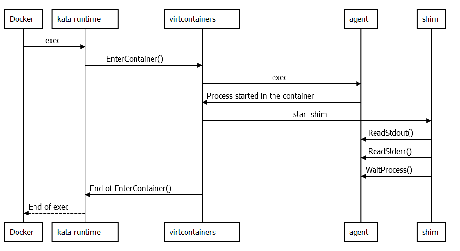

# 结题报告
## 1 项目简介

在云计算应用场景中，以Docker为代表的传统容器在遇到多租户场景时，它的安全问题立刻暴露了出来。 为此，先有kata container 提出安全容器的概念，用虚拟机弥补容器隔离的不足。然而其虚拟机过于重量级的问题，使得AWS对应推出了Firecracker microVM的方案，使得效率和资源消耗都有明显改善。而后有Google 提出的gVisor解决方案， 在容器的后端将所有的系统调用截断，凭借gVisor中用户程序来实现系统调用的API。 gVisor极其轻量，隔离性却也达到了操作系统能带来的隔离程度 。

两种思路都有各自的缺点，firecracker本质上还是传统的虚拟机架构，不可避免地带来多层嵌套的性能损耗。而gVisor 一是面临着隔离性不足的原生容器缺陷，二是面临着过多系统调用时无法忍受的上下文切换。

我们试图利用unikernel得天独厚的轻量和攻击面小的特性，结合虚拟化技术，为FaaS（Function As A Service）场景下的云服务提出一种解决方案：从客户端提交代码，到云平台进行Serverless运算。采用KVM 的虚拟机接口，在虚拟化环境中以unikernel减少资源开销，达到空间的高效利用和速度的极限提升。

## 2 理论依据

### 2.1 Unikernel选取

  

Nanos 是一种新内核，旨在在虚拟化环境中运行一个且仅一个应用程序。 与 Windows 或 Linux 等通用操作系统相比，它有几个限制——即它是一个单进程系统，不支持运行多个程序，也没有用户或通过 ssh 进行远程管理的概念。

### 2.2 libvirt

## 3 技术依据

### kata Container 架构

#### 概述

  `kata-agent` 负责启动容器进程，然后作为一个在虚拟机内守护进程，它使用ttRPC和host OS通信，shim-v2可以发送容器管理命令给agent，同时也可作为I/O stream的数据传输协议。

#### kata的虚拟化映射接口

上层接口：为了支持完整的CRI API 实现，kata需要提供以下结构

下层接口：这些结构需要进一步被映射到和虚拟机交互的设备

#### kata的Hypervisor和VMM技术

Firecracker拥有非常有限的设备模型，提供轻量级的服务并且暴露的攻击面极小，不过，Firecracker 不支持文件系统分享，仅支持block-based 存储驱动。同时，它也不支持设备热插拔和VFIO。

所以Firecracker用到的虚拟设备有如下：

- virtio VSOCK
- virtio block
- virtio net

summary： upstream Firecracker, rust-VMM based, no VFIO, no FS sharing, no memory/CPU hotplug 

## 技术路线

### 实现内核镜像的构建

#### linux 发行版

Kata Container runtime 需要创建虚拟机来隔离工作进程，虚拟机中需要内核镜像

需要五部分，来打造linux 镜像

- rootfs
- Guest OS
- initrd
- Base OS
- dracut

#### 自定义OS

对于Unikernel 自定义镜像，

可以参考`QAT customized kernel and rootfs`

使用`QAT build dockerfiles` 来产生支持Intel QAT hardware

以上内容，官方文档已经给出详细文档，在此不赘述，详见：https://github.com/kata-containers/osbuilder#terms

### 实现Unikernel与虚拟机的接口

#### kata-Container Interface model：

#### 需要实现的接口模块以适配 unikernel

- vsock 
- virtio-net
- virtio-blk
- virtio-fs

#### 需要改写的kata 模块以适配unikernel

##### kata-runtime

重要的OCI命令

- create
  - 创建网络namespace，开启VM和shim 进程
  - 召唤 pre-start hook
  - 从network namespace扫描，创建veth和tap的通信链路
  - 启动kata-proxy，用来模块间通信
  - 和kata-agent通信来配置沙盒
  - 开启kata-shim

- exec
- - 向kata-agent 发送proxy请求，开启新的进程
  - 创建新的kata-shim 在已有的namespace中代表新的进程

##### kata-agent 

包括和unikernel的接口和管理其生命周期

### Unikernel的选取

参考实现 Rumprun，使用c编写，包含有主流高级语言依赖，真正做到根据应用分发。

### 实现 并入Kubernetes生态

尽可能多的CRI-API实现，参考下图API

## 参考资料

OSbuilder：https://github.com/kata-containers/osbuilder#qat-customized-kernel-and-rootfs

kata threat model：https://github.com/kata-containers/documentation/blob/master/design/threat-model/threat-model.md

kata virtualization：https://github.com/kata-containers/kata-containers/blob/main/docs/design/virtualization.md#firecrackerkvm

kata architecture：https://github.com/kata-containers/kata-containers/blob/main/docs/design/architecture.md

kata-runtime：https://github.com/kata-containers/runtime#architecture-overview

kata-agent：https://github.com/kata-containers/agent

kata-design：https://github.com/kata-containers/kata-containers/tree/main/docs/design