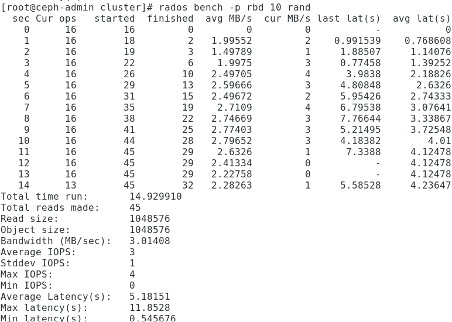
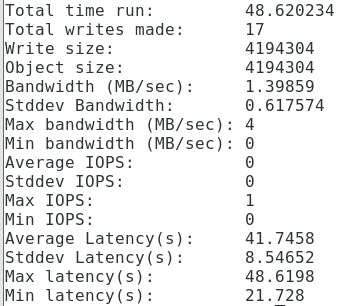

# 测试文档

## 分布式I/O测试和优化尝试

**2节点4个OSD**

### 顺序读


### 随机读



### 写测试 1M 包大小

```shell
rados bench -p rbd 10 write -b 1M --no-cleanup
```


对其配置进行改变，删去一半的osd

**2节点2个OSD** 


**写测试 1M包**


带宽明显地下降

**增加pgs为256**


包大小4M，测试结果和docker相比并无太大差异

### 分析

增大OSD数量一定程度地提高带宽。

pgs的个数128, 256对于4个osd来说，速度上并无明显差异

## dockerI/O测试

```shell
rados bench -p rbd 10 write -b 4M --no-cleanup
```

区别于上面，这里每个包大小4M



## 单节点I/O测试

使用dd 测试10MB写入


由于在单机上运行，不需要受网络带宽限制，最大化发挥硬盘读写速度

